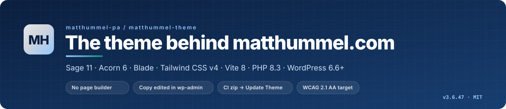
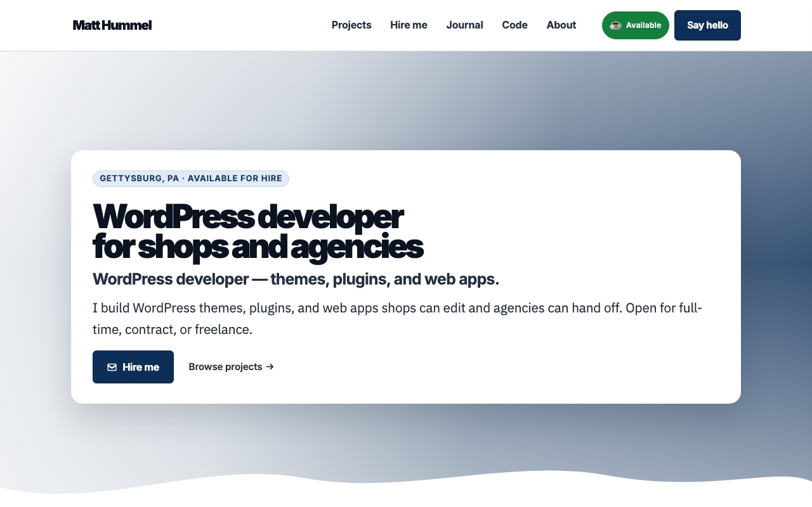
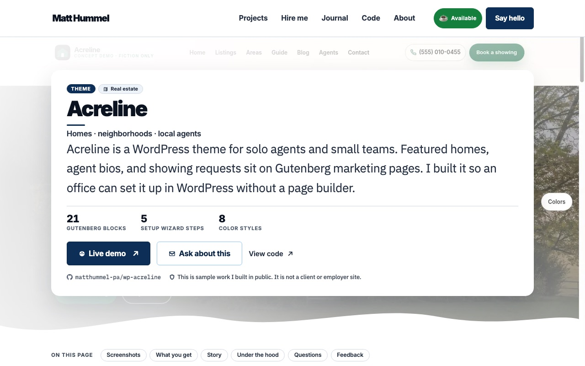
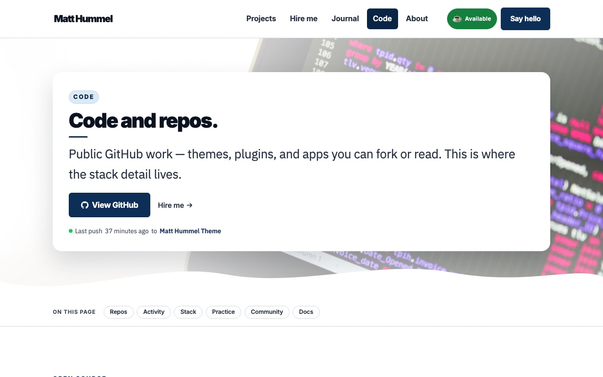
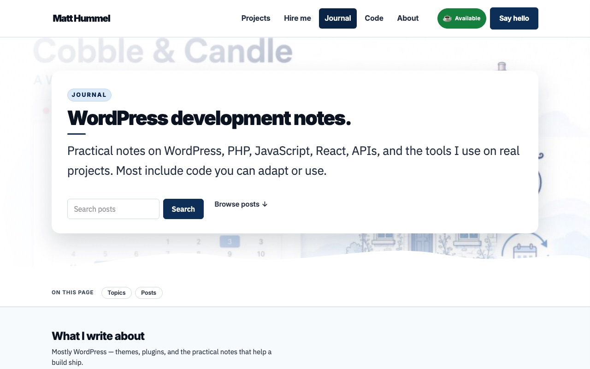

<p align="center">
  <a href="https://matthummel.com"></a>
</p>

<p align="center">
  <a href="https://github.com/matthummel-pa/matthummel-theme/actions/workflows/ci.yml"></a>
  <a href="https://github.com/matthummel-pa/matthummel-theme/actions/workflows/deploy.yml"></a>
  <a href="https://github.com/matthummel-pa/matthummel-theme/releases/tag/theme-latest"></a>
  
  
  
  
  
  <a href="LICENSE.md"></a>
</p>

# matthummel-theme

The custom WordPress theme that runs **[matthummel.com](https://matthummel.com)** — a portfolio, project catalog, journal, and small shop for a full-stack WordPress developer. Built from an empty [Sage 11](https://roots.io/sage/) scaffold into a production site with its own content model, SEO layer, publishing tools, and release pipeline. No page builder, no premium plugins; PHP does the work, Blade renders it, Vite ships it.

This README is written for two readers: **developers** who want to run or review the code, and **hiring managers** who want to see how I plan, build, test, and ship a real WordPress project end to end.

<table>
  <tr>
    <td align="center"><a href="https://matthummel.com/"></a><br /><sub><strong>Home</strong> — one hero, one primary action</sub></td>
    <td align="center"><a href="https://matthummel.com/projects/acreline/"></a><br /><sub><strong>Project page</strong> — landing-page order, live GitHub facts</sub></td>
  </tr>
  <tr>
    <td align="center"><a href="https://matthummel.com/code/"></a><br /><sub><strong>Code</strong> — GitHub API board, cached in transients</sub></td>
    <td align="center"><a href="https://matthummel.com/blog/"></a><br /><sub><strong>Journal</strong> — posts with comments, share cards, newsletter</sub></td>
  </tr>
</table>

## At a glance

| | |
| --- | --- |
| **Live site** | [matthummel.com](https://matthummel.com) · Hostinger (LiteSpeed) · PHP 8.3 |
| **Stack** | Sage 11.2 · Acorn 6 · Blade · Tailwind CSS v4 · Vite 8 · WordPress 6.6+ · Composer · Node 22 |
| **Size** | 29 PHP modules (~30k lines) · 22 page templates + 50 partials (~14.5k lines of Blade) · 20 JS modules (~2.1k lines) · ~24k lines of CSS |
| **Admin surface** | 362 editable page-content fields · 35 Customizer settings · 9 WP-CLI commands · 12 AJAX actions · custom Projects post type |
| **History** | 629 commits on 41 working days · 188 tagged releases (3.0.0 → 3.6.48, Aug 19 → Oct 6, 2026) · every change through a PR |
| **Quality gates** | Pint · WordPress Coding Standards on changed lines (`wp-review`) · PHPStan level 5 config · Vite build · security review before merge |
| **Release** | Merge to `main` → GitHub Actions builds a zip → Release `theme-latest` → **Appearance → Update Theme** installs it |
| **License** | [MIT](LICENSE.md) |

## Contents

- [Why this project](#why-this-project)
- [Features](#features)
- [Architecture](#architecture)
- [How it was built](#how-it-was-built)
- [Engineering practices](#engineering-practices)
- [What I learned](#what-i-learned)
- [Local development](#local-development)
- [Deploy](#deploy)
- [Repository map](#repository-map)
- [Related repositories](#related-repositories)
- [Credits and license](#credits-and-license)

## Why this project

A personal site is the one project where the developer is also the client, the content editor, and the person on call. I used that to make deliberate choices I would recommend to a shop or agency, then lived with them:

- **Copy belongs to the editor, not the template.** Every visitor-facing sentence is a field in wp-admin (**Page content (theme)**) with a sensible default in code. The site can be re-worded without a deploy, and templates stay free of prose.
- **Core Gutenberg is enough.** Pages use named Blade templates; posts use the block editor. No page builder, no ACF, no premium plugin lock-in.
- **A real content model.** Projects are a custom post type seeded from a versioned JSON catalog, with their own landing pages, GitHub facts, screenshots, FAQ, structured data, and (when for sale) a WooCommerce product.
- **Ship like a product.** Semver releases, a changelog visitors can read, CI that builds the artifact, and a one-click updater in wp-admin. Git is the source of truth; the live server is never edited by hand.
- **Accessible and fast by default.** WCAG 2.1 AA target, keyboard paths, 0 CLS, server-rendered HTML, small JS modules that only run where they are needed.

## Features

<details open>
<summary><strong>Content and editing</strong></summary>

- **Page content (theme)** meta box on every named template: 362 keys (text, textarea, HTML, repeaters) registered in [`app/page-fields.php`](app/page-fields.php) and read with `\App\field('key', 'Default')`. Blank field → default in code.
- **22 named Blade templates**: Home, About, Hire, Services, Projects, Code, Contact, Start (project brief), Now, Uses, Resources, Support, Changelog, Get updates, Thank you, Accessibility, Privacy, Terms, Affiliate disclosure, WooCommerce, Blog, Custom.
- **Projects custom post type** with admin meta boxes (summary, story, deliverables, benefits, metrics, screenshots, FAQ, GitHub repo, demo URL, version, license, compatible, brand palette) and a versioned catalog seeder (`resources/data/product-catalog.json`) that fills empty fields and never overwrites edits.
- **Block editor off on marketing pages** (classic editor + fields); posts keep Gutenberg with theme blocks (Tool Blocks, ship pipeline).
- **Customizer**: hero, booking link, GitHub/Bluesky/DEV.to/Facebook credentials, social defaults — 35 settings, secrets stored as `password` controls or wp-config constants.
</details>

<details open>
<summary><strong>Portfolio and sales</strong></summary>

- **Project landing pages** at `/projects/{slug}/`: hero with proof strip and one primary action, screenshot gallery with lightbox, "what you get" checklist (deduplicated), three-step story, spec table beside architecture notes, FAQ, visitor like/star, comments, and an ask form — see [3.6.44](CHANGELOG.md).
- **Projects listing** with search, type filters, grid/list toggle, and `FAQPage` JSON-LD.
- **WooCommerce digital shop** for theme and plugin packs: Blade product templates, classic Cart/Checkout pages, sticky buy bar, post-purchase zip delivery, update emails, My Account desk (`app/shop.php`, `app/woocommerce.php`).
- **Support hub** rendering product guides from GitHub docs as HTML pages.
- **Live GitHub board** on `/code/`: profile, 90-day contribution calendar, activity feed, repo cards — fetched through `App\Github` and cached in transients with a token read from wp-config or the Customizer.
</details>

<details open>
<summary><strong>Journal and publishing</strong></summary>

- **Posts** with reading progress, table-of-contents spy, VS Code-style code blocks with copy button, author bio, related posts, affiliate disclosure, and an end-of-post newsletter signup.
- **Comments** with ASCII/markdown formatting, preview, and reply notifications.
- **Social share cards** in the editor: per-network drafts (Bluesky, Facebook, LinkedIn, Reddit, DEV.to) with Generate (OpenAI or rule-based), Post, Share dialog, and Copy. Bluesky posts over the AT Protocol, Facebook to a Page via the Graph API, DEV.to via its API; auto-share on publish is optional.
- **DEV.to import/export**: HTML → Markdown conversion, canonical URLs, hourly import of new DEV.to articles.
- **Featured image generation** (OpenAI Images) from the post editor and the Projects admin.
- **Newsletter** — the bundled [`matthummel-newsletter`](plugins/matthummel-newsletter) plugin (1.11.0): double opt-in, issues with layouts, a wizard, archive, tracking tokens, a11y checks in CI. Nothing leaves the WordPress database.
</details>

<details open>
<summary><strong>SEO, social meta, and structured data</strong></summary>

- Title and description pipeline with defaults per landing page, term-archive fallbacks, and a hand-off to the [MH SEO](https://github.com/matthummel-pa/mh-seo) plugin when it manages the head.
- Open Graph and Twitter cards with image dimensions and alt; JSON-LD (`WebSite`, `Person`, `WebPage`, `BreadcrumbList`, `BlogPosting`, `FAQPage`, `SoftwareApplication` with `Offer` when for sale).
- Legacy URL redirects, `/journal/` → `/blog/`, canonical control, noindex per page, sitemap exclusion.
- Admin **SEO score column** on post lists, fed by MH SEO.
</details>

<details open>
<summary><strong>Forms and integrations</strong></summary>

- **Plugin-free contact and project-brief forms**: nonce + honeypot, sanitized input, draft kept in a transient, POST to an n8n CRM webhook with `wp_mail` fallback, thank-you page.
- **Integrations**: GitHub REST, DEV.to API, Bluesky AT Protocol, Facebook Graph, LinkedIn profile helpers, OpenAI (text + images), n8n. Every call fails soft — cached or empty UI, never a white screen.
</details>

<details open>
<summary><strong>Security, performance, accessibility</strong></summary>

- Security headers from the theme (HSTS, `X-Content-Type-Options`, `X-Frame-Options` except on embeds, `Referrer-Policy`, `Permissions-Policy`); REST user listing and `?author=` enumeration closed; XML-RPC and pingbacks off; generator version removed; `.blade.php` denied by `.htaccess`.
- Every `$_POST`/`$_GET` read goes through `wp_unslash()` + `sanitize_*()`; every state change checks a nonce and a capability; Blade `{{ }}` escapes by default and `{!! !!}` is reserved for already-escaped HTML.
- Images carry width/height and lazy-load below the fold; CLS is 0 on every audited page; third-party scripts are limited to Site Kit.
- WCAG 2.1 AA target: skip link, landmarks, focus-visible rings, `inert` mobile menu with focus trap, labelled forms, `prefers-reduced-motion`, contrast-checked tokens. Public statement at [/accessibility/](https://matthummel.com/accessibility/).
</details>

<details open>
<summary><strong>Operations</strong></summary>

- **Appearance → Update Theme**: downloads the `theme-latest` release zip over HTTPS with a fine-grained PAT (Contents: Read) and installs it; `wp mh theme-update` does the same from the CLI, `wp mh theme-build` dispatches a rebuild.
- **WP-CLI**: `mh theme-update`, `mh theme-build`, `mh devto-import`, `mh devto-export`, `mh devto-sync`, `mh bluesky-share`, `mh github-refresh`, `mh shop-downloads`, `mh shop-notify-updates`.
- **Database migration** scripts (`.github/scripts/db-pull.sh`) and one-time, flag-guarded data migrations in code.
- **Docs that ship with the code**: [CHANGELOG](CHANGELOG.md), [FEATURES](docs/FEATURES.md) (editor's notes per release), [ERRORS](docs/ERRORS.md), [INSTALL](docs/INSTALL.md), [THEME](docs/THEME.md).
</details>

## Architecture

<p align="center"></p>

**Request.** WordPress resolves the template; `functions.php` boots Acorn and requires the `app/*.php` modules (one concern per file, functions in the `App` namespace). Blade views in `resources/views/` render with `{{ }}` escaping; Vite's manifest maps hashed CSS/JS from `public/build/`.

**Content.** Page copy is post meta written by the Page content (theme) box and read by `\App\field()`. Projects are a CPT whose fields are seeded from `product-catalog.json` behind version flags (`mh_product_catalog_v13`), so a catalog change can ship through CI without touching what an editor typed.

**Integrations.** External data is fetched server-side, cached in transients (6h GitHub, 3h DEV.to), and rendered as HTML — no client-side fetching of content. Tokens live in wp-config constants first, Customizer `password` controls second, and are never printed.

**Ship.** A pull request runs Pint, `wp-review` (WordPress Coding Standards on changed lines), the Vite build, and a security review. Merging to `main` builds the theme with `composer --no-dev` and `npm run build`, packs it with [`pack-theme.sh`](.github/scripts/pack-theme.sh) (dev tooling, docs, and lock files excluded), and publishes Release `theme-latest`. The live site installs that zip from wp-admin or WP-CLI, then LiteSpeed is purged.

Design tokens are CSS custom properties in [`resources/css/app.css`](resources/css/app.css) (`@theme`): Inter for display, IBM Plex Sans for body, IBM Plex Mono for code; navy `#173e70`, accent `#1a5cad`, teal `#0e8a7c`; `--page-max: 1200px`. Dark mode is `html.mh-dark` plus `prefers-color-scheme`.

## How it was built

**Starting point.** The site had run on a Pressroot-based theme (2.x). On 2026-08-19 I started over from the stock Sage 11 scaffold — `composer create-project roots/sage` — and rebuilt every page as a named Blade template with its copy in fields. 3.0.0 shipped the same day; twenty-three patch releases followed in that first week as the templates, fields, and deploy pipeline settled.

**Milestones.**

| Version | Date | What landed |
| --- | --- | --- |
| 3.0.0 | Aug 19 | Sage 11 rebuild: layouts, header/footer, page-field system, GitHub Actions release zip |
| 3.1.0 – 3.1.10 | Aug 24–26 | Journal: single post layout, TOC, code blocks, comments, share intents |
| 3.1.18 – 3.1.29 | Aug 27–31 | Social drafts + Bluesky auto-share, DEV.to export, Projects CPT, featured-image generation, WooCommerce shop, n8n forms |
| 3.1.48 – 3.1.66 | Sep | Hire/recruiter pages, project catalog for sale, Rank Math field analysis |
| 3.5.x | Sep | Shop-first marketing, cart/checkout desk, My Account, downloadable zips, update emails; then "Products become Projects" (3.5.28) and the decluttered portfolio home |
| 3.6.0 – 3.6.23 | Sep–Oct | Project pages, aligned heroes, shared "On this page" nav, typography scale, footer and hover systems |
| 3.6.35 – 3.6.42 | Oct | Visitor like/star + comments on projects, newsletter plugin (double opt-in, wizard, archive), Now page with live activity |
| 3.6.44 – 3.6.48 | Oct 3–6 | Project pages as landing pages, site audit fixes, social share cards, larger project grid without the FAQ sidebar |

**Working method.** Each change starts with a one-line goal and a short plan, lands as a small PR named after the change, and gets reviewed before merge — by me and by a second tool (a security-review agent for anything touching input, output, or credentials). After every visible change I audit the live page: Lighthouse, axe-core, a crawl of titles/descriptions/links, keyboard pass. Findings become the next PR. The [FEATURES](docs/FEATURES.md) file carries an "editor's note" per release so a future change does not undo a deliberate decision.

**AI as a pair, not an author.** Cursor and Claude scaffold first drafts and run the audits; I read, run, and test every line that ships, and the AI never has write access to the live site. The commit history is the honest record — 629 reviewable commits, not one generated dump.

## Engineering practices

| Practice | How it shows up here |
| --- | --- |
| **Small PRs, conventional commits** | `feat` / `fix` / `docs` / `chore`; the body says *why*. Squash-merged with the PR number. |
| **Automated gates** | [`ci.yml`](.github/workflows/ci.yml): Composer, Vite build, Pint, newsletter email a11y check. [`wp-review.yml`](.github/workflows/wp-review.yml): WordPress Coding Standards (escaping, sanitizing, nonces, i18n, `$wpdb->prepare`) on changed lines. PHPStan level 5 with WordPress and WooCommerce stubs. |
| **Security review** | Every PR that touches input, output, headers, or credentials gets a written review (Blocker → Should fix → Nit) and the fixes land before merge — see the 3.6.46 and 3.6.47 notes. |
| **Escape late, sanitize early** | Blade `{{ }}`; `esc_url()` on every `href`/`src`; `wp_kses()` with an allowlist where helpers return markup; `wp_unslash()` + `sanitize_*()` on all request input; capability + nonce on every write. |
| **Fail soft** | Every external call has a timeout, retries where it matters, cached fallbacks, and an empty-state UI. The site renders with GitHub, DEV.to, or OpenAI down. |
| **Content safety** | Seeders fill empty fields only; one-time migrations run behind option flags; nothing deletes posts, terms, or media. |
| **Documentation as part of the change** | CHANGELOG entry, FEATURES editor's note, and README/THEME updates ship in the same PR as the code. |
| **Measured, not assumed** | Lighthouse and axe runs on home, a project page, and a post; crawl of all 51 sitemap URLs; findings tracked in a running audit notebook. |

## What I learned

Things this project taught me that I now apply to client work:

1. **Keep prose out of templates.** The first time a sentence needed changing without a deploy, the field system paid for itself. It also kept 14k lines of Blade readable.
2. **Cache HTML or cache assets — decide, then design for it.** Hashed Vite filenames plus a page cache means stale HTML can point at deleted CSS. The theme sends `no-cache` on HTML and the updater purges LiteSpeed; the next step is letting the page cache back on once purge-on-install is automatic.
3. **Shared hosting ignores things you assume work.** A theme-level `.htaccess` was not honored on the host, and `robots.txt` was answered by the edge before WordPress. Verify with `curl`, not with the docs.
4. **WordPress leaks by default.** `/wp-json/wp/v2/users` lists authors, `?author=1` redirects to the username, XML-RPC answers, the generator tag prints the version. Closing those is a few lines in `app/filters.php` — but only if you look.
5. **Classic meta boxes and the block editor fight over the same meta.** A box that renders old values and posts them on save will overwrite what a sidebar just saved over REST. Scope the box to fields the sidebar does not own.
6. **One moving release tag beats FTP.** `theme-latest` + an in-admin updater removed every "which files did I upload" conversation. The build runs on a clean runner, so "works on my machine" cannot ship.
7. **Seed data must respect editors.** Version-flagged catalog seeds that fill only empty fields let content ship through git without clobbering wp-admin edits.
8. **Accessibility findings cluster in third-party UI.** The theme's own pages audited clean; the contrast failures came from a plugin's reading-guide text. Override in the theme, fix at the source.
9. **Structured data is easy to over-emit.** An `Article` node with `wordCount: 0` on a contact page is noise. Pages are `WebPage`; posts are `BlogPosting`; projects are `Article` + `SoftwareApplication`.
10. **A design-system vocabulary keeps a one-person project consistent.** Tokens, a few component classes (`btn`, `pill`, `work-card`), and "last-win" CSS files with versioned comments made 188 releases converge instead of drift.
11. **AI assistance needs the same gates as a junior developer.** It is fast and often right; it also invents functions and skips nonces. Review, lint, and a second reviewer caught every one of those before they shipped.
12. **Write the editor's note.** The FEATURES file's "do not restore X" lines prevented at least a dozen regressions when revisiting old templates.

## Local development

Requires PHP 8.3, Composer 2, Node 22, and a local WordPress (WordPress Studio, Herd, Local, wp-env, or `wp server` with the SQLite drop-in). The theme folder **must** be named `matthummel` — Vite's `base` is `/wp-content/themes/matthummel/public/build/`.

```bash
git clone https://github.com/matthummel-pa/matthummel-theme.git matthummel
cd matthummel
composer install && npm install && npm run build

# Link into your WordPress install
ln -sfn "$PWD" /path/to/wordpress/wp-content/themes/matthummel

# In the WordPress root
wp theme activate matthummel
wp acorn view:clear
wp rewrite structure '/%postname%/'
```

| Command | Purpose |
| --- | --- |
| `npm run dev` | Vite with HMR |
| `npm run build` | Compile to `public/build/` (gitignored; CI builds it for release) |
| `vendor/bin/pint` / `--test` | Fix / check PHP style |
| `wp-review --base origin/main` | WordPress Coding Standards on changed lines (from [wp-dev-kit](https://github.com/matthummel-pa/wp-dev-kit)) |
| `wp acorn view:clear` | Clear compiled Blade after template edits |
| `wp mh theme-update` | Install the `theme-latest` zip on any WordPress install |

Troubleshooting (white screen, missing CSS, manifest errors, SQLite bootstrap): [docs/ERRORS.md](docs/ERRORS.md). Cloud / agent environment notes: [AGENTS.md](AGENTS.md).

## Deploy

```text
PR merged to main
  └─ .github/workflows/deploy.yml
       ├─ composer install --no-dev --optimize-autoloader
       ├─ npm ci && npm run build
       ├─ pack-theme.sh → matthummel.zip (no docs, lock files, dev configs, or logs)
       └─ GitHub Release "theme-latest" (tag moves, zip attached)
                └─ Appearance → Update Theme  (or: wp mh theme-update)
                     └─ purge LiteSpeed
```

A merged PR is **not live** until the zip is installed. Credentials: a fine-grained PAT with **Contents: Read**, saved on the Update Theme screen or as `MH_GITHUB_TOKEN` in `wp-config.php`. Details: [docs/INSTALL.md](docs/INSTALL.md) · [docs/sage/deployment.md](docs/sage/deployment.md).

## Repository map

```text
app/                      PHP modules, one concern each (fields, SEO, forms, shop, GitHub, social, updater, CLI)
resources/views/          Blade: layouts/, sections/ (header, footer), partials/, template-*.blade.php, woocommerce/
resources/css/            app.css (@theme tokens) · portfolio.css · studio.css (last-win) · journal-blocks.css · code-page.css
resources/js/             Small modules: nav, section spy, galleries, forms, share cards, admin helpers
resources/data/           product-catalog.json, concept-pages.json (versioned seeds)
resources/images/         Logo, profile photo, product screenshots
plugins/matthummel-newsletter/   Bundled newsletter plugin (separate zip, own CI job)
mu-plugins/               Rank Math REST meta bridge, fatal probe
.github/workflows/        ci.yml · wp-review.yml · deploy.yml · plugin-newsletter.yml · diagnose-live.yml
.github/scripts/          pack-theme.sh · build-vite-assets.mjs · db-pull.sh · importers · wp-review
docs/                     THEME.md (deep dive) · FEATURES.md (editor's notes) · ERRORS.md · INSTALL.md · playbooks
public/build/             Vite output — built by CI, never committed
```

## Related repositories

| Repo | What it is |
| --- | --- |
| [wp-cobbleandcandle](https://github.com/matthummel-pa/wp-cobbleandcandle) | Sage 11 block theme for restaurants, taverns, and inns — featured on the site |
| [wp-acreline](https://github.com/matthummel-pa/wp-acreline) | Sage 11 real-estate theme with 21 Gutenberg blocks and a setup wizard |
| [wp-walkridge](https://github.com/matthummel-pa/wp-walkridge) | Sage 11 tour-shop theme with WooCommerce bookings |
| [tocguide](https://github.com/matthummel-pa/tocguide) | Server-rendered Table of Contents block (free, GPLv2+) |
| [mh-seo](https://github.com/matthummel-pa/mh-seo) | The SEO plugin this theme hands its head output to |
| [wp-dev-kit](https://github.com/matthummel-pa/wp-dev-kit) | `wp-review`, review checklist, and the Claude/Cursor rules used on every repo |
| [matthummel-pa](https://github.com/matthummel-pa/matthummel-pa) | Profile README that pulls projects and posts from this site |

## Credits and license

Built by [Matt Hummel](https://matthummel.com) in Gettysburg, PA. Framework: [Sage](https://roots.io/sage/) and [Acorn](https://roots.io/acorn/) by Roots (MIT). Fonts: Inter, IBM Plex. Icons are inline SVG. Third-party notices in [CREDITS.md](CREDITS.md).

Licensed under the [MIT License](LICENSE.md). The product themes and plugins linked above carry their own licenses.

<p align="center"><sub>Open for freelance, contract, and full-time WordPress work — <a href="https://matthummel.com/hire/">matthummel.com/hire</a></sub></p>
